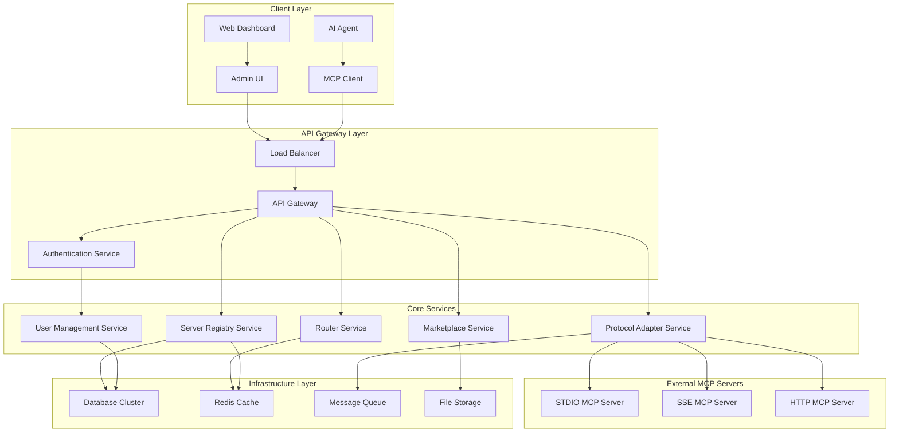
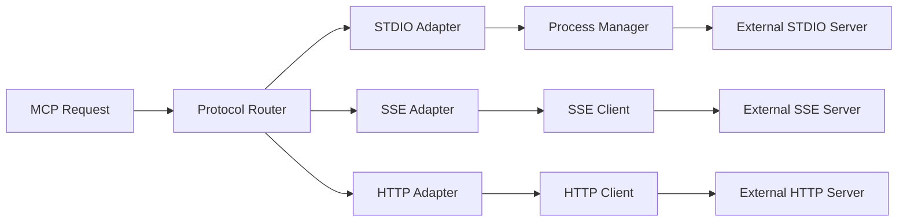
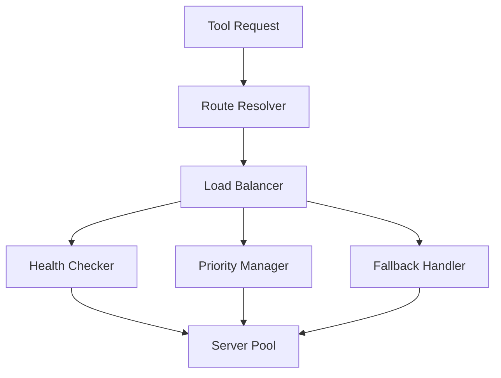

# 설계 문서

## 개요

MCP Hub는 멀티 테넌트 환경에서 다양한 MCP(Model Context Protocol) 서버를 중앙 집중식으로 관리하고 라우팅하는 클라우드 서비스입니다. 사용자별 격리, 프로토콜 어댑터, 동적 라우팅, 마켓플레이스를 통합한 완전한 MCP 관리 플랫폼을 제공합니다.

## 아키텍처

### 전체 시스템 아키텍처



### 모듈별 아키텍처

#### 1. Protocol Adapter Service


#### 2. Router Service


## 컴포넌트 및 인터페이스

### 1. User Management Service

**책임**: 사용자 계정, 인증, API 키 관리

**주요 컴포넌트**:
- `UserController`: 사용자 CRUD 작업
- `AuthService`: JWT 토큰 기반 인증
- `ApiKeyManager`: API 키 생성/검증/취소
- `RateLimiter`: 사용량 제한 관리

**인터페이스**:
```typescript
interface UserManagementService {
  createUser(userData: UserCreateRequest): Promise<User>
  authenticateUser(credentials: LoginRequest): Promise<AuthToken>
  generateApiKey(userId: string, permissions: Permission[]): Promise<ApiKey>
  validateApiKey(apiKey: string): Promise<ApiKeyValidation>
  revokeApiKey(apiKeyId: string): Promise<void>
  checkRateLimit(apiKey: string): Promise<RateLimitStatus>
}
```

### 2. Server Registry Service

**책임**: MCP 서버 등록, 메타데이터 관리, 그룹핑

**주요 컴포넌트**:
- `ServerController`: 서버 등록/수정/삭제
- `GroupManager`: 서버 그룹 관리
- `MetadataService`: 서버 메타데이터 관리
- `HealthMonitor`: 서버 상태 모니터링

**인터페이스**:
```typescript
interface ServerRegistryService {
  registerServer(userId: string, serverConfig: ServerConfig): Promise<RegisteredServer>
  updateServer(serverId: string, updates: ServerUpdate): Promise<RegisteredServer>
  deleteServer(serverId: string): Promise<void>
  createGroup(userId: string, groupConfig: GroupConfig): Promise<ServerGroup>
  assignServerToGroup(serverId: string, groupId: string): Promise<void>
  getServersByUser(userId: string): Promise<RegisteredServer[]>
  getServersByGroup(groupId: string): Promise<RegisteredServer[]>
}
```

### 3. Protocol Adapter Service

**책임**: 다양한 MCP 프로토콜 간 변환 및 통신

**주요 컴포넌트**:
- `ProtocolRouter`: 프로토콜별 어댑터 선택
- `StdioAdapter`: STDIO 프로토콜 처리
- `SseAdapter`: SSE 프로토콜 처리
- `HttpAdapter`: HTTP 프로토콜 처리
- `MessageTransformer`: 프로토콜 간 메시지 변환

**인터페이스**:
```typescript
interface ProtocolAdapterService {
  createAdapter(serverConfig: ServerConfig): Promise<ProtocolAdapter>
  sendRequest(adapterId: string, request: McpRequest): Promise<McpResponse>
  streamRequest(adapterId: string, request: McpRequest): AsyncIterable<McpStreamResponse>
  closeAdapter(adapterId: string): Promise<void>
  getAdapterHealth(adapterId: string): Promise<AdapterHealth>
}
```

### 4. Router Service

**책임**: 도구 요청 라우팅, 로드 밸런싱, 장애 조치

**주요 컴포넌트**:
- `RouteResolver`: 도구 이름 기반 서버 선택
- `LoadBalancer`: 라운드 로빈, 가중치 기반 분산
- `HealthChecker`: 서버 상태 확인
- `FallbackManager`: 장애 시 대체 서버 선택

**인터페이스**:
```typescript
interface RouterService {
  routeToolCall(endpointId: string, toolName: string, params: any): Promise<ToolCallResult>
  getAvailableTools(endpointId: string): Promise<ToolDefinition[]>
  setRoutingRules(groupId: string, rules: RoutingRule[]): Promise<void>
  getServerHealth(serverId: string): Promise<ServerHealth>
}
```

### 5. Marketplace Service

**책임**: 공개 MCP 서버 마켓플레이스 관리

**주요 컴포넌트**:
- `MarketplaceController`: 마켓플레이스 API
- `PackageManager`: 서버 패키지 관리
- `InstallationService`: 서버 설치 및 구성
- `VersionManager`: 서버 버전 관리

**인터페이스**:
```typescript
interface MarketplaceService {
  listAvailableServers(): Promise<MarketplaceServer[]>
  getServerDetails(serverId: string): Promise<ServerDetails>
  installServer(userId: string, serverId: string, config: InstallConfig): Promise<Installation>
  updateServer(installationId: string): Promise<Installation>
  uninstallServer(installationId: string): Promise<void>
}
```

## 데이터 모델

### 1. 사용자 관련 모델

```typescript
interface User {
  id: string
  email: string
  username: string
  passwordHash: string
  createdAt: Date
  updatedAt: Date
  subscription: SubscriptionTier
}

interface ApiKey {
  id: string
  userId: string
  key: string
  name: string
  permissions: Permission[]
  rateLimit: RateLimit
  createdAt: Date
  expiresAt?: Date
  lastUsedAt?: Date
}

interface RateLimit {
  requestsPerHour: number
  requestsPerDay: number
  maxServers: number
}
```

### 2. 서버 관련 모델

```typescript
interface RegisteredServer {
  id: string
  userId: string
  name: string
  protocol: 'stdio' | 'sse' | 'http'
  config: ServerConfig
  namespace?: string
  status: 'active' | 'inactive' | 'error'
  lastHealthCheck: Date
  createdAt: Date
  updatedAt: Date
}

interface ServerConfig {
  stdio?: {
    command: string
    args: string[]
    env: Record<string, string>
  }
  sse?: {
    url: string
    headers: Record<string, string>
  }
  http?: {
    baseUrl: string
    headers: Record<string, string>
  }
}

interface ServerGroup {
  id: string
  userId: string
  name: string
  description: string
  serverIds: string[]
  routingRules: RoutingRule[]
  createdAt: Date
  updatedAt: Date
}
```

### 3. 엔드포인트 관련 모델

```typescript
interface Endpoint {
  id: string
  userId: string
  groupId?: string
  url: string
  sseUrl: string
  httpUrl: string
  apiKeyId: string
  createdAt: Date
  lastAccessedAt?: Date
}

interface RoutingRule {
  id: string
  condition: RoutingCondition
  targetServerId: string
  priority: number
  enabled: boolean
}

interface RoutingCondition {
  toolName?: string
  parameterMatch?: Record<string, any>
  serverTags?: string[]
}
```

## 오류 처리

### 오류 분류 및 처리 전략

#### 1. 클라이언트 오류 (4xx)
- **401 Unauthorized**: 유효하지 않은 API 키
- **403 Forbidden**: 권한 부족, 사용량 제한 초과
- **404 Not Found**: 존재하지 않는 도구 또는 서버
- **429 Too Many Requests**: 요청 제한 초과

#### 2. 서버 오류 (5xx)
- **500 Internal Server Error**: 예상치 못한 시스템 오류
- **502 Bad Gateway**: 외부 MCP 서버 연결 실패
- **503 Service Unavailable**: 서비스 일시 중단
- **504 Gateway Timeout**: 외부 서버 응답 시간 초과

### 오류 응답 형식

```typescript
interface ErrorResponse {
  error: {
    code: string
    message: string
    details?: any
    timestamp: string
    requestId: string
  }
}
```

### 재시도 및 장애 조치

```typescript
interface RetryPolicy {
  maxAttempts: number
  backoffStrategy: 'exponential' | 'linear' | 'fixed'
  baseDelay: number
  maxDelay: number
  retryableErrors: string[]
}

interface FallbackStrategy {
  enabled: boolean
  fallbackServers: string[]
  timeoutMs: number
  circuitBreakerThreshold: number
}
```

## 테스트 전략

### 1. 단위 테스트
- **범위**: 각 서비스의 개별 메서드
- **도구**: Jest, Mocha
- **목표 커버리지**: 90% 이상

### 2. 통합 테스트
- **범위**: 서비스 간 상호작용
- **시나리오**: 
  - 사용자 등록 → 서버 등록 → 도구 호출
  - 프로토콜 어댑터 변환 테스트
  - 라우팅 규칙 적용 테스트

### 3. 성능 테스트
- **부하 테스트**: 동시 사용자 1000명 기준
- **스트레스 테스트**: 시스템 한계점 측정
- **지연 시간 테스트**: 도구 호출 응답 시간 < 500ms

### 4. 보안 테스트
- **인증/인가 테스트**: API 키 검증
- **입력 검증 테스트**: SQL 인젝션, XSS 방지
- **암호화 테스트**: 환경변수 암호화 검증

### 테스트 환경 구성

```typescript
interface TestEnvironment {
  database: 'in-memory' | 'docker-postgres'
  externalServices: 'mock' | 'staging'
  logging: 'debug' | 'error'
  cleanup: boolean
}
```

### 테스트 데이터 관리

```typescript
interface TestDataFactory {
  createUser(overrides?: Partial<User>): User
  createServer(userId: string, overrides?: Partial<ServerConfig>): RegisteredServer
  createApiKey(userId: string, overrides?: Partial<ApiKey>): ApiKey
  createGroup(userId: string, overrides?: Partial<ServerGroup>): ServerGroup
}
```

이 설계는 확장 가능하고 유지보수가 용이한 마이크로서비스 아키텍처를 기반으로 하며, 각 컴포넌트가 명확한 책임을 가지도록 구성되었습니다.